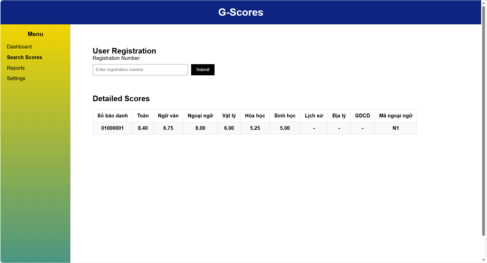

# G-Scores
# Decription
This is a website project for looking up exam scores using registration numbers, displaying charts and statistics. This website addresses [the web development intern assignment problem](https://github.com/GoldenOwlAsia/webdev-intern-assignment-3).
# Demo

[Link to detailed video](https://drive.google.com/file/d/120-ZWbj6Y-yiF2MEsoWoe2EkDix5KW-k/view?usp=sharing)
# Tech Stack
- Python 3.11
- Django
- SQLite
- HTML, CSS
# Installation
1. ```bash
git clone https://github.com/ThanTitan472/G-Scores-python-webite.git
2. ```bash
cd mysite
3. ```bash
pip install django
4. ``` bash
python manage.py seeder
5. ``` bash
python manage.py makemigrations
6. ``` bash
python manage.py migrate
7. ``` bash
python manage.py runserver
# Features
- Look up exam scores using your registration number.

- Display a score distribution chart across subjects.

- Statistics of the top 10 students with the highest exam scores in Group A (Mathematics, Physics, Chemistry).
# Author
Name: Võ Phi Thân
Email: vothan472@gmail.com